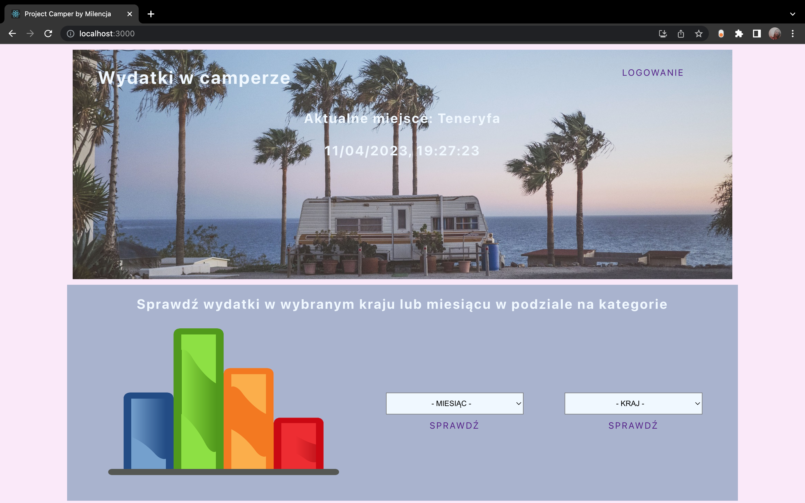
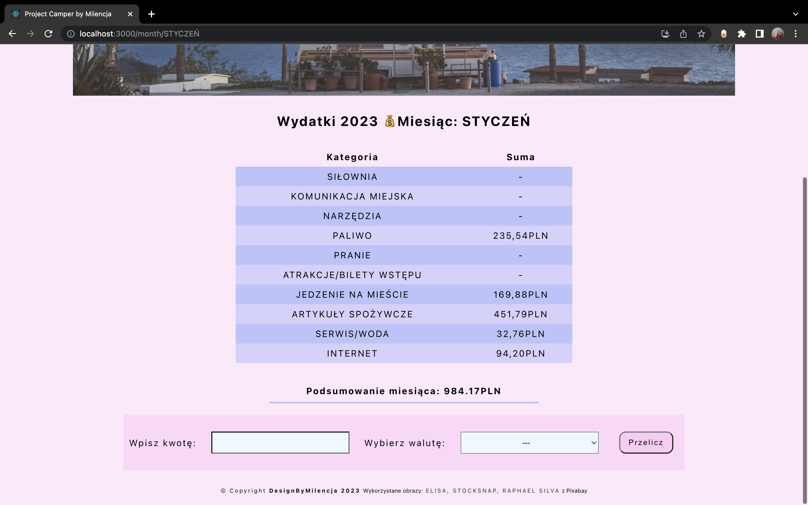
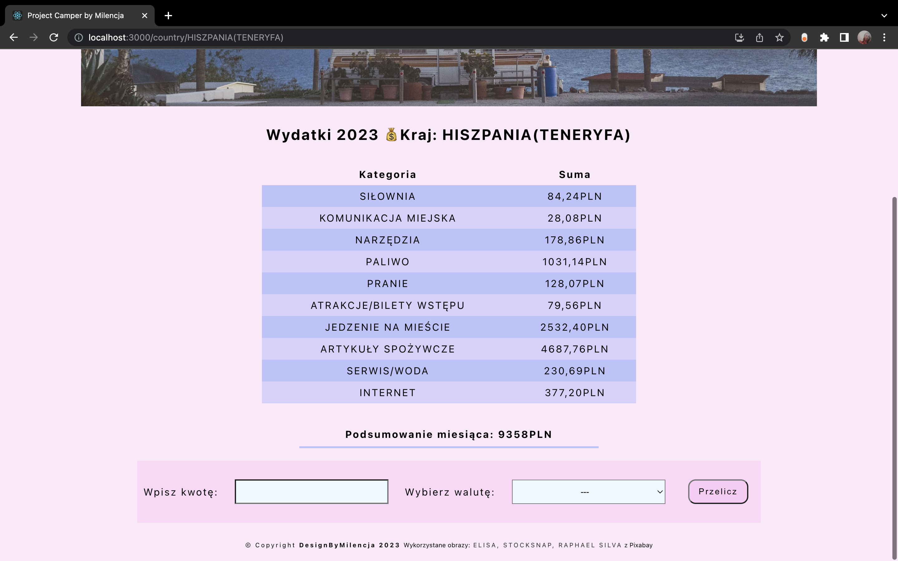
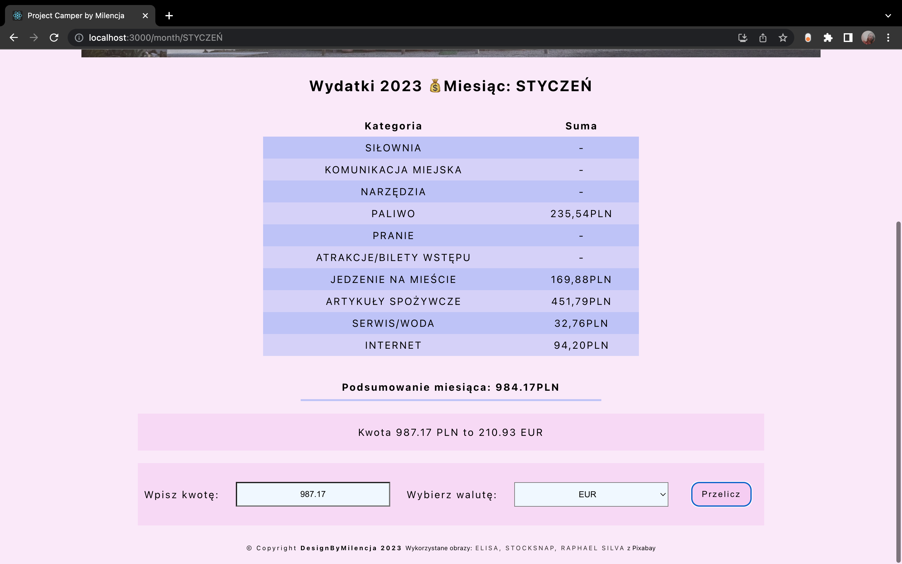
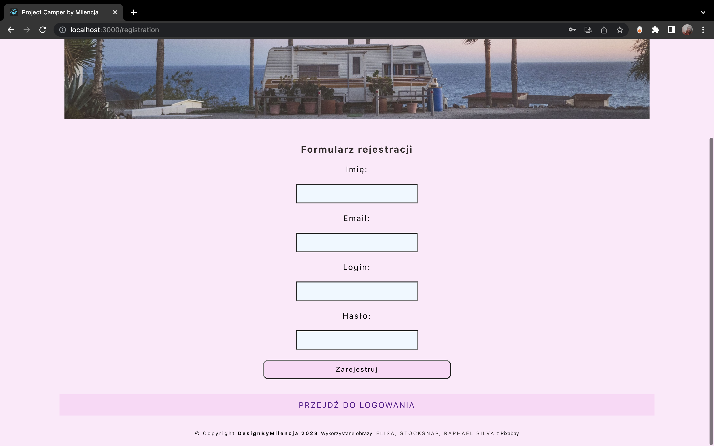
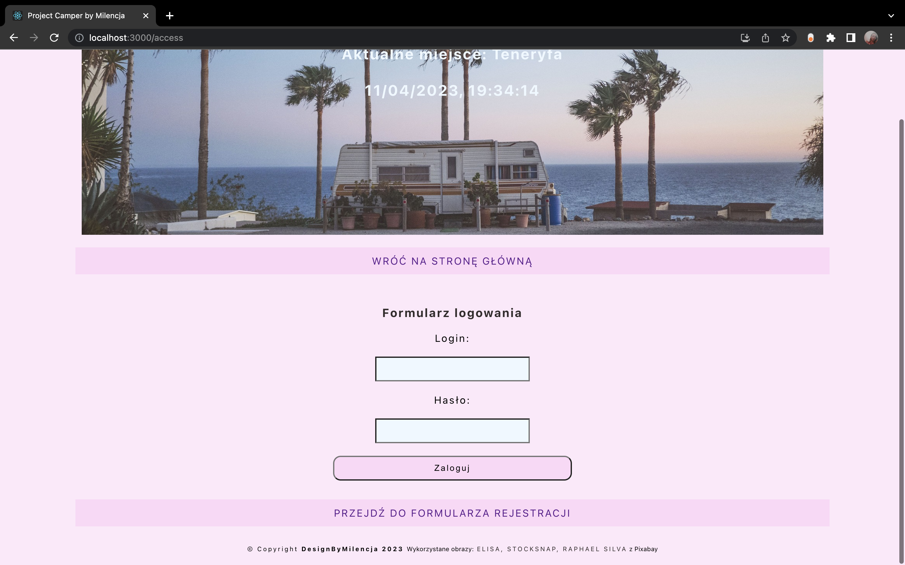
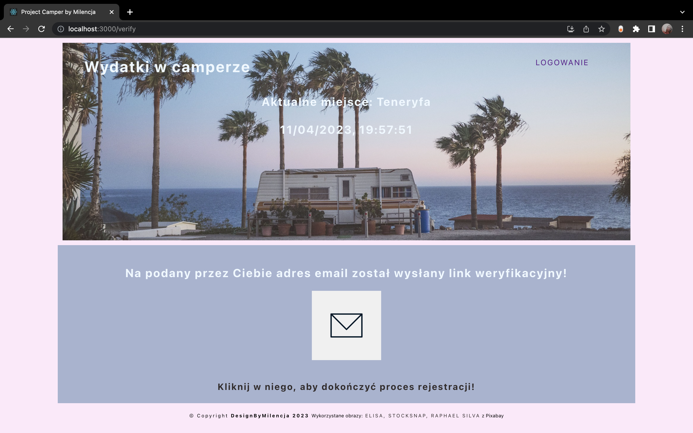
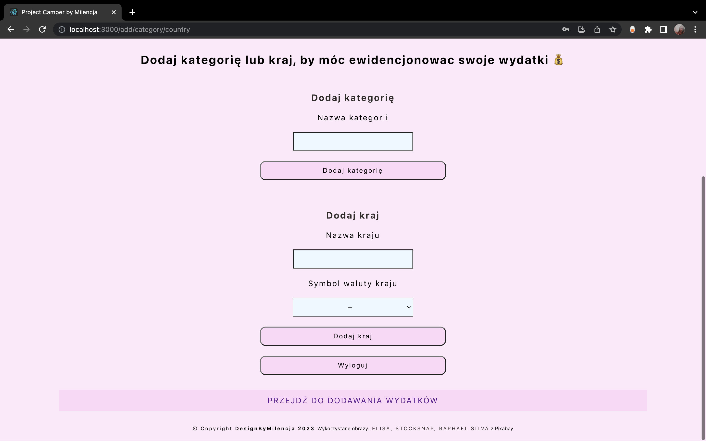
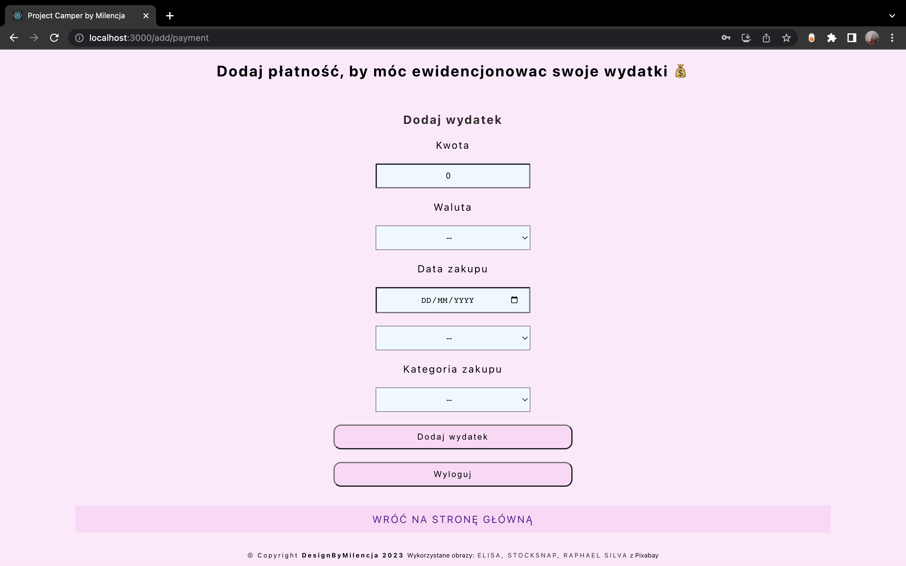

# Project Camper Backend 🚐
This is my individual project for Mega Kurs. The idea and code is my creation.
Link to working app https://projectcamper.networkmanager.pl/
## Table of Contents
* [General info](#general-info)
* [Screenshots](#screenshots)
* [Features](#features)
* [Technologies used](#technologies-used)
* [Contact](#contact)

## General Info
The main purpose of my application is to record my daily expenses during travelling by camper van. On the basis of costs shown in different countries and over different months, users will be able to plan their travel budget. In the future, I want to make the app available to users so that they can also use it when travelling and collate their expenses

## Screenshots

## Features
- [x] active records are responsible for adding, deleting, updating categories, country and expenses
- [x] methods search single and all categories, countries and expenditures
- [x] methods aggregating expenses by selected assumption
- [x] registration and login possibility
- [x] types combined between frontend and backend
- [x] function that converts the amount added in a foreign currency to PLN and adds it to the database   
- [x] use of the jsonwebtoken library and express session to block access to certain views for non-logged-in users
- [ ] expansion to include user tables and a log-in for each user, so that everyone can keep track of their expenses on the website.
- [ ] list of months designed for the current year, to be extended over a longer period in the future

## Technologies Used
  
 

## Contact
Created by designByMilencja - feel free to contact me!
designbymilencja@gmail.com
